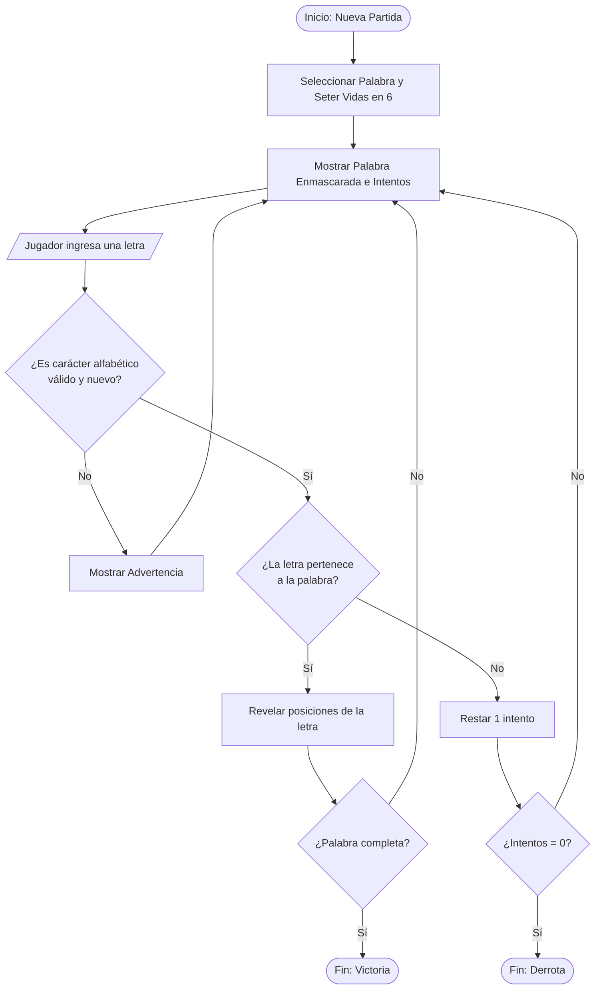
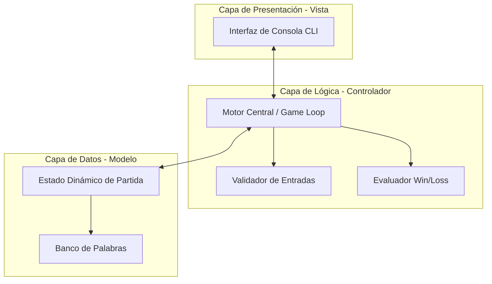

# Proyecto final de asignaatura
# 🎮 Juego del Ahorcado (MVC)

Este repositorio contiene la arquitectura de software, diagramas lógicos e implementación del **Juego del Ahorcado** bajo la especificación del estándar de Lógica de Programación.

## 📊 1. Diagrama de Flujo Funcional

El comportamiento lógico del ciclo de juego (Game Loop) y sus compuertas condicionales de validación de entradas están estructurados de la siguiente forma:



## 🏛️ 2. Diagrama de Arquitectura de Software

Estructura modular diseñada bajo el patrón de Separación de Responsabilidades para aislar los efectos secundarios de la terminal:



## 🛠️ 3. Ejecución Local del Sistema

Para levantar la solución en un entorno limpio y controlado:

```bash
# Activar entorno virtual
source .venv/bin/activate  # Windows: .venv\Scripts\activate

# Correr programa
python main.py
```

---

## 🏃‍♂️ Instrucciones de Ejecución para el Des
